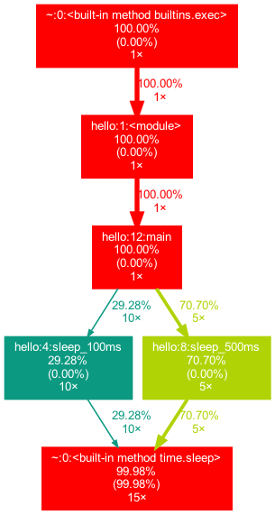

# hello-cprofile
playground of cProfile

## Requirements

For visualization, install graphviz and gprof2dot.

On MacOS with homebrew run

```
brew install graphviz
pip install gprof2dot
```

## How to run

profiling

```shell
python -m cProfile -o profile_hello.pstats hello.py
```

analyze

```shell
python analyze.py profile_hello.pstats
```

visualize

```shell
gprof2dot -f pstats profile_hello.pstats | dot -Tpng -o profile_hello.png
```

## Results

output of analyze.py

``shell
$ python analyze.py profile_hello.pstats
['analyze.py', 'profile_hello.pstats']
Tue Dec 15 10:50:35 2020    profile_hello.pstats

         49 function calls in 3.561 seconds

   Ordered by: internal time

   ncalls  tottime  percall  cumtime  percall filename:lineno(function)
       15    3.560    0.237    3.560    0.237 {built-in method time.sleep}
       15    0.001    0.000    0.001    0.000 {built-in method builtins.print}
        1    0.000    0.000    3.561    3.561 hello.py:12(main)
       10    0.000    0.000    1.043    0.104 hello.py:4(sleep_100ms)
        5    0.000    0.000    2.517    0.503 hello.py:8(sleep_500ms)
        1    0.000    0.000    3.561    3.561 {built-in method builtins.exec}
        1    0.000    0.000    3.561    3.561 hello.py:1(<module>)
        1    0.000    0.000    0.000    0.000 {method 'disable' of '_lsprof.Profiler' objects}


   Ordered by: internal time

Function                                          was called by...
                                                      ncalls  tottime  cumtime
{built-in method time.sleep}                      <-      10    1.043    1.043  hello.py:4(sleep_100ms)
                                                           5    2.517    2.517  hello.py:8(sleep_500ms)
{built-in method builtins.print}                  <-      15    0.001    0.001  hello.py:12(main)
hello.py:12(main)                                 <-       1    0.000    3.561  hello.py:1(<module>)
hello.py:4(sleep_100ms)                           <-      10    0.000    1.043  hello.py:12(main)
hello.py:8(sleep_500ms)                           <-       5    0.000    2.517  hello.py:12(main)
{built-in method builtins.exec}                   <-
hello.py:1(<module>)                              <-       1    0.000    3.561  {built-in method builtins.exec}
{method 'disable' of '_lsprof.Profiler' objects}  <-
```

output of gprof2dot


